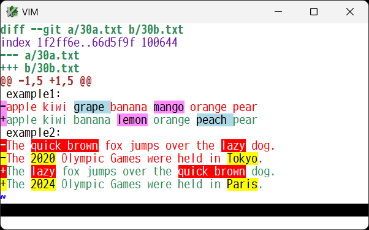
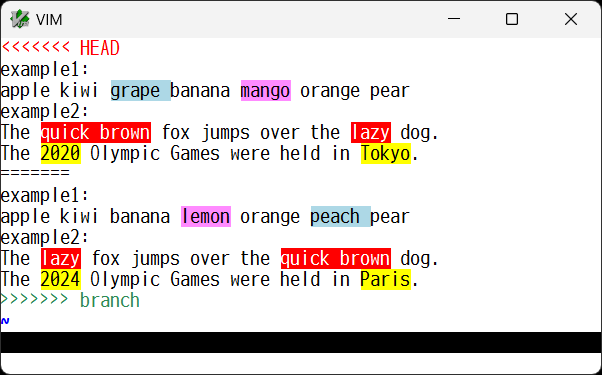
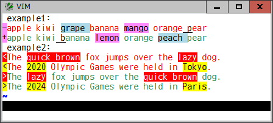

# diffunitsyntax

### Highlight word or character based diff units in diff format

This plugin is an additional vim syntax for diff format and highlights
changed/added/deleted diff units on word or character basis, to make it
possible to see the actual inline differences. It should work well on a git
wrapper plugin such as [vim-fugitive](https://github.com/tpope/vim-fugitive) and
[vim-signify](https://github.com/mhinz/vim-signify).

For example, a diff file in unified format will be shown like this:

This syntax plugin does:
* identify either of unified, context, or normal "ed" style diff format, which
  can be provided by some program like **diff** and **git diff** commands
* find corresponding changed lines to be compared
* split each line to a list of diff units, based on the `DiffUnit`
  buffer-local or global variable
* compare them and find the changed/added/deleted units, using a builtin
  `diff()` function or a plugin specific function along with the `diffopt`
  option
* show those units in single or several background-colored syntax highlights,
  based on the `DiffColors` buffer-local or global variable

In addition to those standard diff formats, if the file extension is ".diff"
or the `syntax` option is set to "diff", this syntax plugin identifies a file
including **git conflict markers** and **diff indicators (`-`/`+` and `<`/`>`)**,
and then shows the diff units like this:

git conflict markers: 

diff indicators: 

#### Options

* `b:DiffUnit`, `g:DiffUnit`: A type of diff unit

  | Value | Description |
  | --- | --- |
  | 'Char' | any single character |
  | 'Word1' | `\w\+` word and any `\W` single character (default) |
  | 'Word2' | non-space and space words |
  | 'Word3' | `\<` or `\>` character class boundaries (set by `iskeyword` option) |
  | 'word' | see `word` |
  | 'WORD' | see `WORD` |

* `b:DiffColors`, `g:DiffColors`: Highlight group for changed units (`hl-DiffAdd` for added units)

  | Value | Description |
  | --- | --- |
  | 0 | `hl-DiffChange` |
  | 1 | `hl-DiffChange` + several highlight groups (default) |

* `b:DiffUnitSyntax`, `g:DiffUnitSyntax` : Enable or disable this syntax plugin

  | Value | Description |
  | --- | --- |
  | 0 | disable |
  | 1 | enable (default) |
