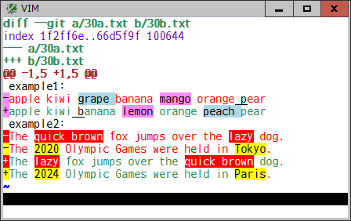

# diffunitsyntax

### Highlight word or character based diff units in diff format

This plugin finds and highlights word or character based changed/added/deleted
diff units in a diff format, to make it possible to see the actual differences
within a line. This plugin not only works as an additional vim syntax for diff
format but also applies the intra-line diff unit highlighting on some popular
git-related plugins.

When a file name extension is `.diff` or the `syntax` option is set to `diff`,
a diff file in unified format will be shown like this:

This plugin does:
* identify either of unified, context, or normal "ed" style diff format, which
  can be provided by some program like `diff` and `git diff` commands
* find a pair of corresponding changed lines to be compared in a buffer
* split each line to a list of diff units, based on the `DiffUnit`
  buffer-local or global variable
* compare them and find the changed/added/deleted units, using a builtin
  `diff()` function or a plugin specific function along with the `diffopt`
  option
* highlight those diff units according to syntax, text property, or extended
  mark mechanism applied on the buffer, using single or several
  background-colored highlight groups, based on the `DiffColors` buffer-local
  or global variable

In addition to those standard diff formats, this plugin identifies a file
including git conflict markers and diff indicators (`-`/`+` and `<`/`>`),
and then shows the diff units.
 

git conflict markers

diff indicators

#### Diff unit highlighting on plugins

In some popular git-related plugins, to show `git diff` output and to preview
a diff hunk in normal, preview, and popup/floating windows, another
highlighting mechanism such as text property or extended mark is used instead
of diff syntax. This plugin applies the intra-line diff unit highlighting and
show actual differences on them, based on the `DiffUnitSyntax` buffer-local or
global variable, on the following plugins (you are welcome to introduce more
plugins to cover!):

In normal window:

vim-fugitive

[vim-fugitive](https://github.com/tpope/vim-fugitive) 

neogit

[neogit](https://github.com/NeogitOrg/neogit) 

vim-gin

[vim-gin](https://github.com/lambdalisue/vim-gin) 

In preview and popup/floating windows:

gtsigns.nvim

[gitsigns.nvim](https://github.com/lewis6991/gitsigns.nvim) 

vim-gitgutter

[vim-gitgutter](https://github.com/airblade/vim-gitgutter) 

vim-signify

[vim-signify](https://github.com/mhinz/vim-signify) 

#### Options

* `b:DiffUnit`, `g:DiffUnit`: A type of diff unit

  | Value | Description |
  | --- | --- |
  | 'Char' | any single character |
  | 'Word1' | `\w\+` word and any `\W` single character (default) |
  | 'Word2' | non-space and space words |
  | 'Word3' | `\<` or `\>` character class boundaries (set by `iskeyword` option) |
  | 'word' | see `word` |
  | 'WORD' | see `WORD` |

* `b:DiffColors`, `g:DiffColors`: Highlight group for changed units (`hl-DiffAdd` for added units)

  | Value | Description |
  | --- | --- |
  | 0 | `hl-DiffChange` |
  | 1 | `hl-DiffChange` + several highlight groups (default) |

* `b:DiffUnitSyntax`, `g:DiffUnitSyntax` : Disable this plugin or apply diff unit highlighting

  | Value | Description |
  | --- | --- |
  | 0 | disable |
  | 1 | enable in normal window (default) |
  | 2 | enable in normal, preview, and popup/floating windows |
